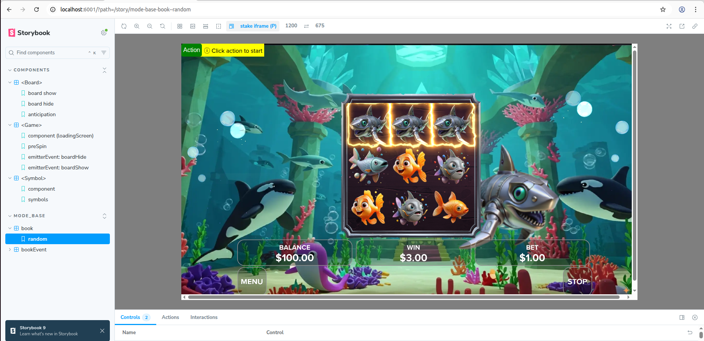
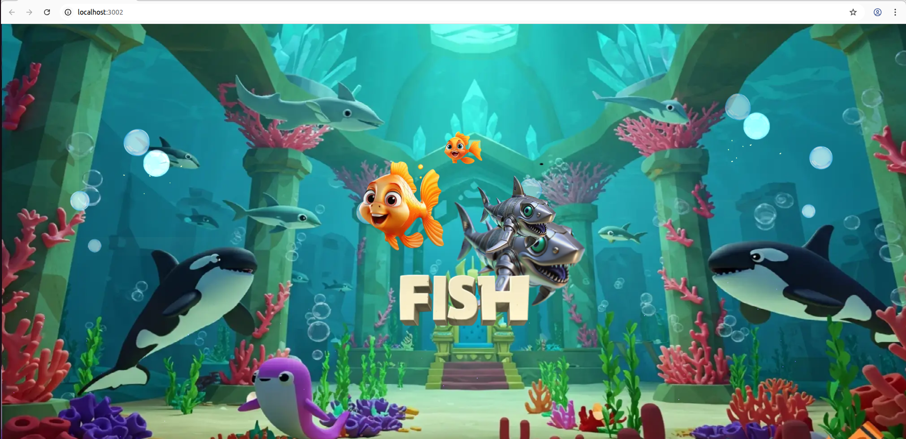

# Web SDK

This is a web sdk that is convenient for you to develop a game in a declarative way. It is an optional way to build and launch your games on with [Stake Engine](https://engine.stake.com/) with some easy steps. It is powered by Svelte 5, PixiJS 8 and TurboRepo.

- How to use: To have 100% freedom to any source code from this repo, start your own codebase based on this repo. You can change any source code as you need.


# Table of Contents

- [Get Started](#getStarted)
  - [Installation](#installation)
  - [Run in Storybook](#runInStorybook)
  - [Run in DEV Mode](#runInDevMode) 

<a name="getStarted"></a>

# Get started

Here is a complete tutorial to start with one of our sample games from storybook running and local test to build and launch it on [Stake Engine](https://engine.stake.com/). Please ignore those steps that you already know or done.

<a name="installation"></a>

## Installation
We use [VSCode](https://code.visualstudio.com/download) as IDE but this is optional and it is up to you.

- Install node with version 22.16.0. [download](https://nodejs.org/en/download)

```
# Download and install nvm:
curl -o- https://raw.githubusercontent.com/nvm-sh/nvm/v0.40.1/install.sh | bash

# in lieu of restarting the shell
\. "$HOME/.nvm/nvm.sh"

# Download and install Node.js:
nvm install 22.16.0

# Verify the node versions. Should print "v22.16.0".
node -v
```

- Install pnpm with version 10.5.0.

```
# Install pnpm
npm install pnpm@10.5.0 -g

# Verify the pnpm versions. Should print "v10.5.0"
pnpm -v
```

- Clone the repo to your local in VS Code terminal or others.

```
git clone https://github.com/StakeEngine/web-sdk.git
cd web-sdk
```

- Install dependencies.

```
pnpm install
```

WIth out any error messages showing up, you are good to continue.

<a name="runInStorybook"></a>

## Run in Storybook

```
pnpm run storybook --filter=lines
```

- Run `pnpm run storybook --filter=<MODULE_NAME>` in the terminal to see the storybook of a sample game in a TurboRepo way. `<MODULE_NAME>` is the name in the package.json file of a module in apps or packages folders.
- For example, we have `"name": "lines"` in the [apps/lines/package.json](/apps/lines/package.json), so we can find it and run its storybook.
- For Windows users, you might need to add the script with "cross-env" to make it work:
```
"storybook": "cross-env PUBLIC_CHROMATIC=true storybook dev -p 6001 public",
```
- You should see this:


- Now switch to `MODE_BASE/book/random` in the left sidebar, you will see an `Action` button appear on the left right conner of the game.



- Click on the `Action` button and wait for a base game to finish.
- Now you are having a game running locally in the storybook.

<a name="runInDevMode"></a>

## Run in DEV Mode
```
pnpm run dev --filter=lines
```
- Open up the url showed in the terminal, you should see this:



- It is all good to have that error screen for now, because we have not connected to the RGS with DEV mode. We will show you how to do that in the launch-a-game step.

- For more information about how the authentication is handled, please refer to [Authenticate.svelte](https://github.com/StakeEngine/web-sdk/blob/main/packages/components-shared/src/components/Authenticate.svelte)

<a name="buildAGame"></a>